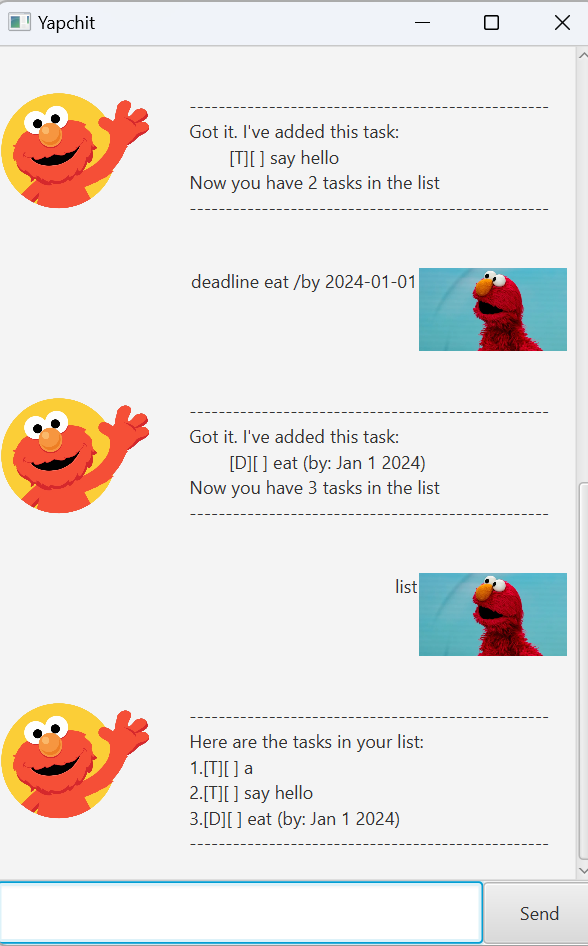

# Yapchit User Guide



Introducing Yapchit

Your favourite task management chatbot.

Yapchit is a chatbot that helps you manage your tasks using simple commands. This offers a faster alternative to your typical task managers if you can type fast!

## Types of Tasks That Can Be Managed

### 1. ToDos:
A Todo is simply a task you have to complete, with no completion time. 
Todos are listed as `[T] [task done?] [task name]`

### 2. Deadlines
A Deadline is a task that you have to complete by a stipulated date. 
Deadlines are listed as:
`[D] [task done?] [task name] (by: [Date in MMM-DD-YYYY format])`

### 3. Events
An event is a task that has a start and end time. 
Times/dates do not have a specific format (unlike deadlines). 
Events are listed as:
`[E] [task done?] [event name] (from: [event from time] to: [event to time])`

## Performing Operations with Tasks

### 1. Adding a Task
A task can be added to the list using its specified format (customised to the type of task). 

Below are task add formats:
- `todo say hello` -> creates task `[T][] say hello`
- `deadline read book /by 2024-02-15` -> creates task `[D][ ] read book (by: Feb 15 2024)`
- `event exams /from today /to tomorrow` -> creates task `[E][ ] exams (from: today to: tomorrow)`

Sample output for first example:
```
----------------------------------------------
Got it! I've added this task:
    [T][] say hello
Now you have 1 task in the list...
----------------------------------------------
```

### 2. Seeing Current Tasks
Current tasks can be seen by typing the command `list`. Tasks are listed in the following format:
`[Task number]. [Task Type][Task done?] [Task Name] [Task Details - if any]`

Example output:
```
---------------------------------------------
Here are the tasks in your list:
1. [T][] say hello
---------------------------------------------
```

### 3. Marking a Task as Done/Not Done
A task can be marked as done by entering `mark` followed by the task number. A task can be marked as not done by entering `unmark` followed by the task number. Examples:
- `mark 1`
- `unmark 1`

Example output:
```
---------------------------------------------
Nice! I've marked this task as done:
  [T][X] say hello
---------------------------------------------

or 

---------------------------------------------
Ok, I've marked this task as not done yet:
  [T][] say hello
---------------------------------------------

```
### 4. Updating a Task
A task can be updated by typing the command `update` followed by the task number, followed by the new task details. If there is any detail that you don't want to update, you may enter the `*` character. The system will maintain the existing detail. Examples:
- `update 1 say bye`
- `update 2 * /by 2024-04-07`
- `update 3 no exams /from may /to june`
- `update 3 * /from now /to *`
  Note that you cannot update a task's type i.e. go from a todo to a deadline because that is essentially creating a new task. You may delete the current task and create a new deadline if that is your goal.

Example output:
```
---------------------------------------------
Ok, I've updated this task:
  [T][] say bye
---------------------------------------------
```
### 5. Deleting a Task
A task can be deleted by typing `delete` followed by the task number. Example:
- `delete 1`
  Example output:
```
---------------------------------------------
Noted. I've removed this task:
  [T][] say bye
Now you have 0 tasks in the list...
---------------------------------------------
```
## Bot Commands

### 1. Ending the Chat with the Bot
You can end the chat with the bot by typing `bye`. The bot will no longer respond to any queries. You can exit the window by pressing enter or closing it.

## General Notes

1. Enter one command at a time.
2. Closing the bot without typing `bye` will still save your tasks, but if you are halfway through a command, the text you have typed will be lost.
3. Entering commands not listed here will result in an error.
